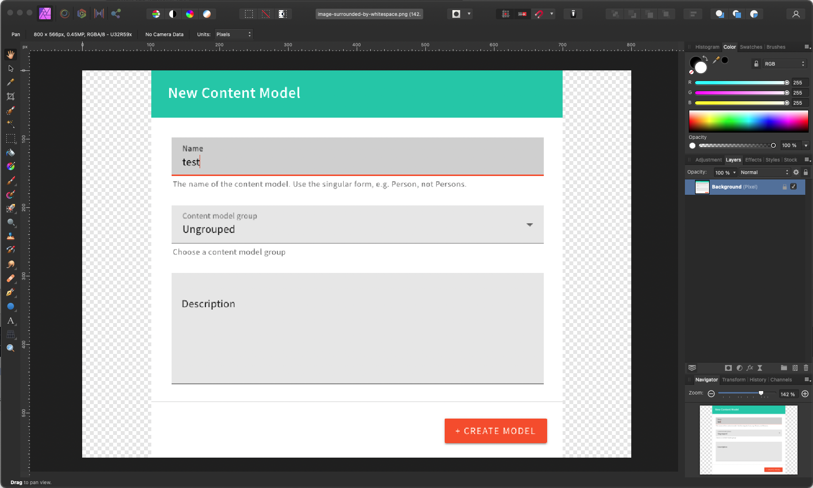
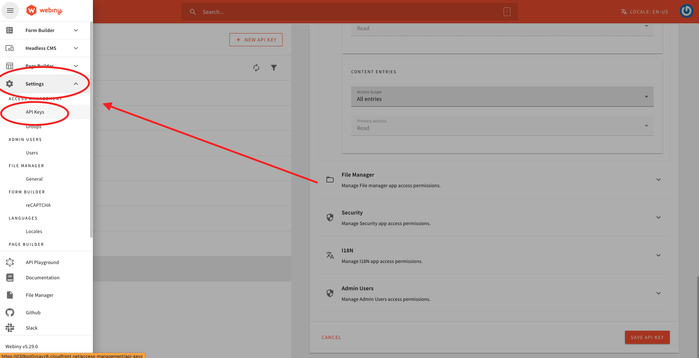
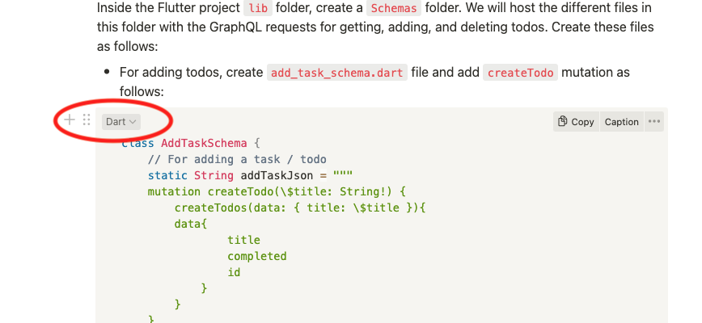

# Styleguide

Get the most out of Writing with Webiny by ensuring your content meets the criteria outlined here. This will minimize the amount of revisions so that both you and us have less work to do and content is ready for publication more quickly.

## What is “Write With Webiny”?

The Write with Webiny program exists to help users get familiar with Webiny and associated technology. We want to ensure each article, together with the code supplied, meets our standards. This is so that as many people as possible can get the most out of the content we are producing. 

Each article submission should be (a) styled well, (b) structured clearly, and (c) formatted properly.

## Styled Well

1. Your article should be comprehensive, and written for those who have little experience.
2. It should be technically correct and with enough detail
3. Cover the topic thoroughly
4. Be friendly but minimal

### 1. Comprehensive, and Written for Those who have Little Experience.

Many newer developers are just beginning their journey towards coding and using Webiny. Therefore each article should be very clear about things that more experienced developers tend to take for granted. 

A good example of this is environment variables and permissions. We assume that people are going to clone our code and use it themselves. So we don’t want to be in any way responsible (even if indirectly) for them committing their API key to a public GitHub repo. To avoid this, we recommend the use of environment variables, and might even warn them about the dangers of not using them.

### 2. Technically Correct, and with Enough Detail

Each code block should have an explanation that will enable a technically minded reader to understand the concept. You should not only write code that is functional and can be easily forked and used by others, but that also is annotated and documented.

**Bad example:**

```jsx
const r = await fetch(a, p)

data.map((d, i) => <div key={i}>{d.title}</div>
```

In this example, there are a lot of leaps for the reader to make. Variable names don’t explain what they are for, and often the context is missing. There’s no obvious connection between the first line and the third because some code has been missed out. Best practices have not been followed, such as using environment variables for sensitive data (such as API keys and URLs).

**Good example:**

```jsx
// parameters to pass to the fetch function
const parameters = {
	method: 'POST',
  headers: {
	  'Content-Type': 'application / json',
		'Authorization': `Bearer ${process.env.API_TOKEN}` // make sure your API token is in the .env file
  }
}

const result = await fetch(process.env.API_URL, parameters)
const data = await result.json()

// map over the posts
data.posts.map(post => {
  // destructure the id and title from data
	const { id, title } = post
	return (
		<div key={id}>{title}</div>
  )
}
```

Even though this example is much more verbose it’s very clear and much easier to pick up and follow. Code comments have been made to further indicate what the code is doing.

### 3. Cover the topic thoroughly

Articles should have a clear introduction and explain the premise clearly. If possible, you should outline a problem that the article will show the reader how to solve. Using keywords is important, so you should repeat the topic and target technologies in the introductory paragraphs.

**Bad example:**

*In this article we will build some pagination.*

There’s little to hook the reader in here. We haven’t given them a reason to stick around and read the article in detail unless they are looking for an answer for a specific problem. There’s little SEO value because no keywords have been used.

**Good example:**

*Fetching data and rendering it in a UI built with React is fantastic … until your blog starts to run into tens, or even hundreds of articles. Once it does, you’ll notice your API calls will slow down to a crawl, and rendering will start to become unresponsive. Let’s look at how you can eliminate these issues using Pagination. What is pagination? What different types of pagination methods exist in GraphQL? How do you fetch data using pagination methods with Apollo Client in a React application? These questions will be answered as we dive into building a paginated blog with React and Webiny Headless CMS.*

When you are helping the reader to create their models and content, please be deliberate about what name the model should have and what type it should be. Ideally, have images for each step (or a short video). The name of the models and fields should be the same throughout your tutorial and the code you submit. This is so that the amount of errors the reader will encounter when they try to follow along with your code will be reduced.

### 4. Be friendly but minimal

Be conversational with your prose. We want people to feel welcome. But don’t overdo it; they’re here to learn and we don’t want to detract from that objective.

Part of being friendly also includes writing **good grammar** in **American English** in your article. We suggest you use [Hemingway](https://hemingwayapp.com/) or [Grammarly](https://www.grammarly.com/) to make sure your sentences are simple, short and easy to read where possible. We will test your grammar and ask you to review your article if we find it’s not up to a good standard.

### Images

Images should be **landscape** and a **minimum of 800px wide and 200px high**. If the content is smaller than that, please format to include whitespace either side. They should also be prepared for high-resolution screens. Ensure that any text on images is minimal and easy to read. Please don’t use images for code snippets.

Images should *always* include appropriate alternative text for screen readers and other assistive devices.

**Good example:**




The checkered area indicates where the canvas has been resized to 800px wide by 200px high. When saved as a .png, the space will be rendered as transparent.

Each image should come with a caption. We will use this information in the `alt` attribute so that the image can be useful to those using assistive technology to follow the tutorial.

### Annotated Images

Quite often, if the user is being asked to click around an interface, more than just text is needed, and even a screenshot of the UI might not show the user where they have to click. In these situations you might use a screenshot tool (or a graphics editor) to circle the clickable area, or point to it with an arrow, or both. Please do not manually draw arrows but use a line or arrow tool.

**Good example:** The screenshot has been annotated leaving the user in no doubt that they need to click on Settings > API Keys in the fly-out menu.




### Animations

If you wish you can support a number of short videos instead of images as appropriate. Please supply these as `.mp4` format. `.gif`s tend to be compressed and can look blurry when we transfer them to our website.

## Structured Clearly

The structure of the article should help the reader follow the logic to its conclusion. It’s like a walk that starts at one location and ends at another. As the one walking makes mental note of certain landmarks as they go, your headings should clearly signpost where they are in the process. You might structure your article similar to this:

- Introduction
- Goals (may be part of the introduction)
- Prerequisites
- Step 1
- Step 2
- … (repeat)
- Conclusion

You can follow the familiar adage “tell them what you’re going to tell them, tell them, then tell them you’ve told them”, when it comes to writing your introduction and conclusion. This means that you are repeating yourself but it helps focus the reader on the subject effectively.

### 1. Introduction

Your introduction should contain the **topics** you’re going to cover, and add a little background as to why this would benefit the user. You should have SEO in mind when you write your introduction, since we will use parts of it for the meta description. But it’s not primarily for bots to parse: it’s aim is to familiarize readers with the subject and prepare them for the content you’re about to show them.

### 2. Prerequisites

The prerequisites should explain what the user will *already need to have* in order to start the tutorial. A deployed Webiny environment, NodeJS installed, AWS credentials, familiarity with a certain technology, anything the user needs to know *before* they start following your tutorial.

### 3. Body

As we have mentioned, the steps you take in the body of your tutorial should be clearly marked, easy for a reader to scan and return to a previous step if they get lost or have to pick it back up after a break. It’s often helpful to number the steps sequentially.

### 4. Conclusion

Your conclusion should repeat in brief what the reader will have learned during the tutorial. You should reiterate its practical value.

## Formatted Properly

Please ensure you have structured your document in a way that we can easily recreate it in a Markdown file. 

### 1. Titles

All titles should use Associated Press styles (this is the default on [https://titlecaseconverter.com](https://titlecaseconverter.com/)). Please be certain not to miss out level headings, for instance skipping from a level 2 to a level 4 (so as to miss out level 3).

### 2. Naming

Make sure you use naming conventions for the technology you’re featuring, and that they are consistent. For example, Open source is two words (shouldn’t be written as “opensource”). “Webiny Headless CMS” should always be written in title case, and acronyms should be capitalized. 

Please invest time finding style guides for technologies or check their websites for pertinent naming conventions.

### 3. Images

Please drop images directly into Notion rather than linking to them from another service.

### 4. Code

Code submissions, both within your article and your supplied code, should be formatted with Prettier or a similar tool.

It should be correctly indented with _tabs_ because spaces cause accessibility issue to some screen readers.

Code blocks within your text should have the correct formatting language associated with the code block to enable syntax hilighting.

This can be done in Notion by hovering over the code block and selecting the language:



## Ready for us to Review?

Completed your article? Great! Follow this steps to get a faster turnaround on your article.

- Submit your article on the Notion page we give you
- publish your code on a Github Repo. We will move the code to our repository when we publish your article
- Send us an invoice with your full name and bank details
- Wait for us to review your article and respond promptly to the comments we make

## Payment

Payment is up to $300 but depends on a number of factors.

We pay within 30 days of receipt of an invoice. We pay via direct bank transfer or PayPal only.

Thank you for reading the styleguide thoroughly. We’re looking forward to your contributions!